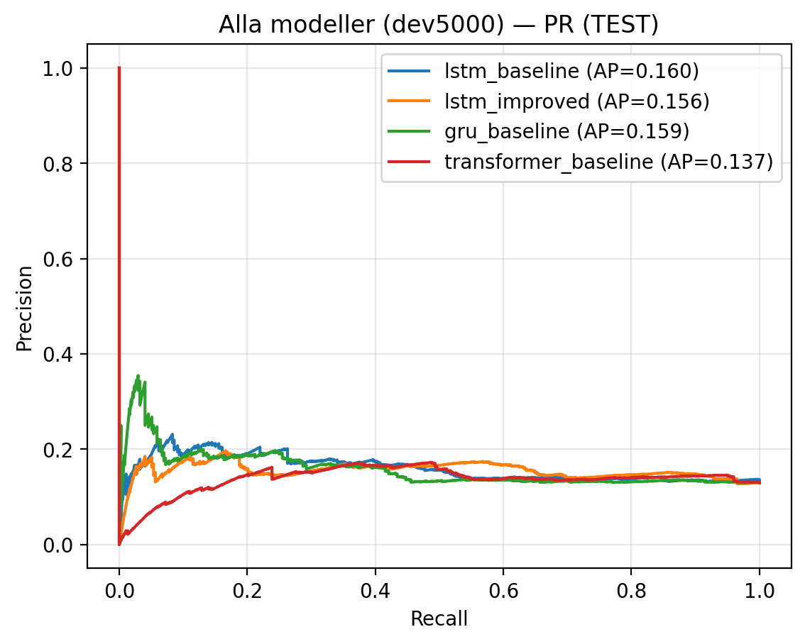
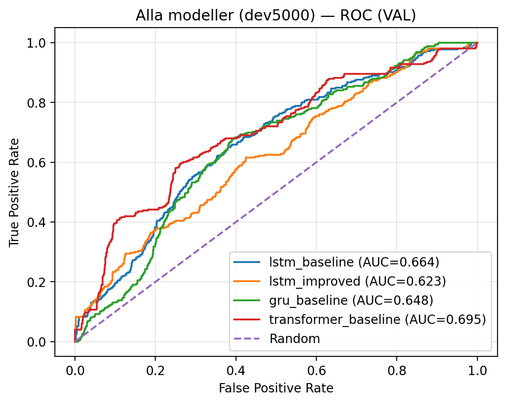

# Sepsis Prediction from ICU Time-Series (Deep Learning)

This project builds and evaluates deep learning models to **predict sepsis onset** from ICU patient time-series data.
It focuses on a **reproducible ML pipeline**, leakage-safe evaluation, and metrics suitable for **class-imbalanced** problems.

## Repository structure
- `notebooks/` — end-to-end workflow (EDA → preprocessing → modeling → evaluation)
- `outputs/tables/` — exported results tables (lightweight)
- `assets/` — key figures used in this README
- `report/` — full technical report (PDF)
- `data/` — dataset is not included (see `data/README.md`)

## Problem setup (high level)
- **Task**: binary classification (sepsis vs non-sepsis) from time-series
- **Goal**: early warning prediction using a fixed history window per patient time point
- **Models**: LSTM, GRU, Transformer

## Results
**Artifacts:** Full technical report in `report/` and evaluation figures in `assets/`.

The full comparison table is available here:
- [model_comparison_dev5000.csv](outputs/tables/model_comparison_dev5000.csv)
- [model_comparison_dev5000.json](outputs/tables/model_comparison_dev5000.json)

Key metrics include PR-AUC (primary), ROC-AUC, and Precision/Recall/F1 at a selected threshold.

- 
## Quick look (figures)
### Precision–Recall



### ROC



Key metrics include PR-AUC (primary), ROC-AUC, and Precision/Recall/F1 at a selected threshold.

## How to run
### 1) Install dependencies
```bash
python -m venv .venv
# Windows: .venv\Scripts\activate
# macOS/Linux: source .venv/bin/activate
pip install -r requirements.txt
